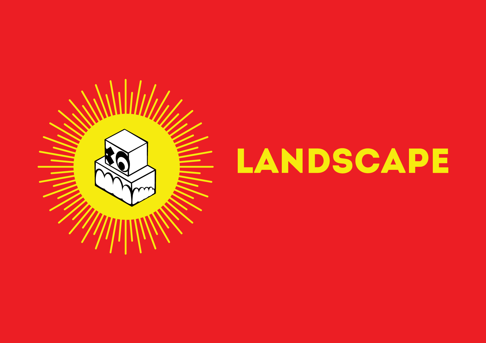
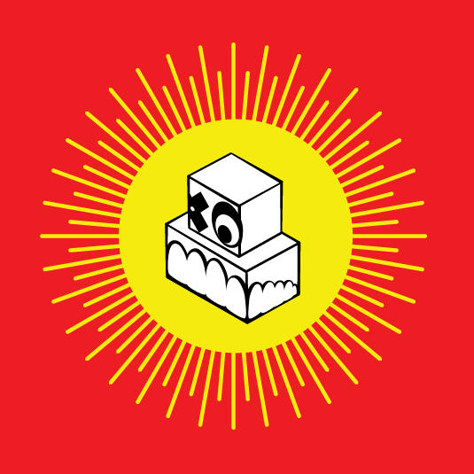

# Slidrr 101

## A first look at quick HTML presentations

### done in markdown

#### and modern css/browser

_(other headers are just to small for presentations)_

done in plain css, js and html

??

Testing notes

--

### A textual example

Content can be written in **Markdown!**
Just follow the `rules` defined [here](https://daringfireball.net/projects/markdown/)

This will be in a separate paragraph, **bold** and _italic_

??

More notes

--

### A list of things

* [Change the css styling](?css=css/test.css#/2)
* [Revert to default css](?#/2)
* Item gamma

No need for multiple templates!

1. just
2. lists
4. are fun

??

still more!

--

### extra Markup

- `--` to create an slide
- `??` to add speaker notes

--

## code blocks

`AaGgTtIiJj123!`
inline `code` or code-block:

```
class GuineaPig {
	var name : String;
	var age : Int;
	public function new(name, age) {
		this.name = name;
		this.age = age;
	}
}
var pig1 = new GuineaPig("Maisie", 1);
var pig2 = new GuineaPig("Tilly", 2);
```

--

# Speaker notes

> “Slidrr quote that will blow you mind”
**Matthijs Kamstra aka [mck]**

(press `s` to see speaker notes)

??

Notes that show **up**

--

# toggle fullscreen

(press `f` to toggle fullscreen)


--

# toggle focus

(press `b` to toggle focus)


--

# toggle help

(press `h` to toggle help)


--



# full-screen image

Start your slide with an image and then write text (if needed)

__tip: use hex value in the alt text to change the background color AND the text color (black or white)__

--


# full-screen image with constrain

Same as previous slide but add an `?` at the end of the image-url

--

# And the default way to show an image



--


#Background color dark

Change the background color `#2c3e50`
without an image
Text with highest contrast (white)

--


#Background color light

Change the background color `#bdc3c7`
without an image
Text with highest contrast (black)


--


# have fun!

Read more about this project at:
<https://github.com/MatthijsKamstra/slidrr>


